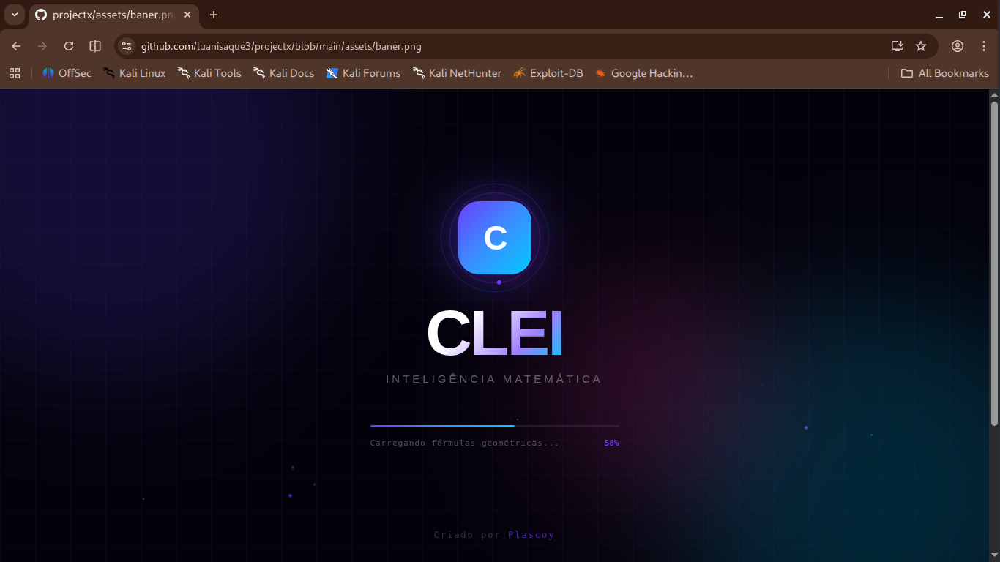

# 🧠 CLEI - Mathematical AI

CLEI é uma Inteligência Artificial Matemática desenvolvida em JavaScript puro que roda diretamente no console do navegador.

# ✨ Funcionalidades

* 🤖 IA Matemática
* 🔢 Calculadora Científica
* 📐 Biblioteca de Fórmulas
* 📋 Histórico de Cálculos
* 🎨 Interface Futurista
* ⚡ Execução Instantânea

# 🚀 Instalação

```bash
F12
```

Abra a aba:

```bash
Console
```

Cole o código da CLEI e pressione:

```bash
ENTER
```

# 💻 Exemplos

```bash
2x² + 5x - 3 = 0
```

```bash
Derivada de 3x⁴ + 2x² - 7x
```

```bash
Integral de 4x³ + 6x dx
```

```bash
18% de 450
```
#imagens 
# CLEI



# 📐 Recursos Matemáticos

* Equações do 1º Grau
* Equações do 2º Grau
* Bhaskara
* Derivadas
* Integrais
* Estatística
* Fibonacci
* Fatorial
* Juros Compostos
* PA e PG
* Trigonometria
* Geometria

# 🎨 Interface

* Loader Animado
* Design Futurista
* Efeitos Neon
* Janela Arrastável
* Redimensionamento
* Sistema de Abas
* Histórico Local

# ⚙️ Tecnologias

```bash
JavaScript
HTML
CSS
LocalStorage
Math Engine
```

# 👨‍💻 Desenvolvedor

```bash
Plascoy
```

# ⭐ Apoie o Projeto

* ⭐ Deixe uma estrela
* 🍴 Faça um fork
* 🚀 Contribua

# 📜 Licença

MIT License

# ❤️ CLEI v2.0

Mathematical Artificial Intelligence

Created by Plascoy
